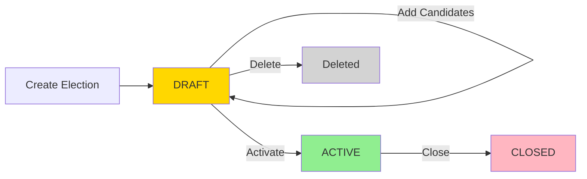

Consensus provides comprehensive election management capabilities, allowing you to create elections, add candidates, and control the election lifecycle.

## Election Lifecycle

Every election in Consensus follows a three-stage lifecycle:

```typescript
// From src/domain/enums/index.ts:8-12
export enum ElectionStatus {
    DRAFT = "DRAFT",     // Election being set up
    ACTIVE = "ACTIVE",   // Currently accepting votes
    CLOSED = "CLOSED",   // Voting ended, results available
}
```

<Steps>
  <Step title="DRAFT">
    Election is being configured. You can add/remove candidates and modify settings.
  </Step>
  <Step title="ACTIVE">
    Election is live and accepting votes. No modifications allowed.
  </Step>
  <Step title="CLOSED">
    Voting has ended. Results are available and final.
  </Step>
</Steps>

<Warning>
  Once an election moves out of DRAFT status, candidates cannot be added or removed. Plan your candidate list carefully.
</Warning>

## Creating an Election

Create a new election by providing essential configuration details:

```typescript
// From src/services/ElectionService.ts:9-15
export interface ElectionCreationDTO {
    name: string;
    electionType: ElectionType;  // FPTP, STV, or AV
    startDate: Date;
    endDate: Date;
    description: string;
}
```

### Date Validation

Elections must have valid start and end dates:

<AccordionGroup>
  <Accordion title="End date after start date">
    ```typescript
    // From src/services/ElectionService.ts:49-51
    if (dto.startDate >= dto.endDate) {
        throw new Error("End date must be after start date");
    }
    ```
  </Accordion>

  <Accordion title="Start date not in the past">
    ```typescript
    // From src/services/ElectionService.ts:54-61
    const today = new Date();
    today.setHours(0, 0, 0, 0);
    const startDay = new Date(dto.startDate);
    startDay.setHours(0, 0, 0, 0);

    if (startDay < today) {
        throw new Error("Start date cannot be in the past");
    }
    ```
    
    <Info>
      The system compares dates only (not times), so you can create an election that starts "today" at any time.
    </Info>
  </Accordion>
</AccordionGroup>

### Initial Status

All new elections are created in DRAFT status:

```typescript
// From src/services/ElectionService.ts:63-71
const election = new Election(
    randomUUID(),
    dto.name,
    dto.electionType,
    dto.startDate,
    dto.endDate,
    dto.description,
    ElectionStatus.DRAFT  // Always starts as DRAFT
);
```

## Managing Candidates

Candidates can only be added or removed while the election is in DRAFT status.

### Adding Candidates

```typescript
// From src/services/ElectionService.ts:17-21
export interface CandidateCreationDTO {
    name: string;
    party: string;
    biography: string;
}
```

**Add a candidate:**
```typescript
// From src/services/ElectionService.ts:81-96
addCandidate(electionID: string, dto: CandidateCreationDTO): Candidate {
    const election = this.electionRepository.findById(electionID);
    if (!election) {
        throw new Error("Election not found");
    }

    if (election.status !== ElectionStatus.DRAFT) {
        throw new Error("Cannot add candidates to non-draft elections");
    }

    const candidate = new Candidate(randomUUID(), electionID, dto.name, dto.party, dto.biography);

    this.candidateRepository.save(candidate);

    return candidate;
}
```

<Warning>
  Attempting to add candidates to an ACTIVE or CLOSED election will fail with an error.
</Warning>

### Removing Candidates

Candidates can only be removed during DRAFT status:

```typescript
// From src/services/ElectionService.ts:101-121
removeCandidate(electionID: string, candidateID: string): void {
    const election = this.electionRepository.findById(electionID);
    if (!election) {
        throw new Error("Election not found");
    }

    if (election.status !== ElectionStatus.DRAFT) {
        throw new Error("Cannot remove candidates from non-draft elections");
    }

    const candidate = this.candidateRepository.findById(candidateID);
    if (!candidate) {
        throw new Error("Candidate not found");
    }

    if (candidate.electionID !== electionID) {
        throw new Error("Candidate does not belong to this election");
    }

    this.candidateRepository.delete(candidateID);
}
```

### Listing Candidates

```typescript
// From src/services/ElectionService.ts:133-135
getCandidates(electionID: string): Candidate[] {
    return this.candidateRepository.findByElectionId(electionID);
}
```

## Activating Elections

Once your election is configured, activate it to begin accepting votes.

### Activation Requirements

<Card title="Minimum 2 candidates required" icon="users">
  Elections must have at least 2 candidates before activation:
  
  ```typescript
  // From src/services/ElectionService.ts:168-171
  const candidates = this.candidateRepository.findByElectionId(electionID);
  if (candidates.length < 2) {
      throw new Error("Election must have at least 2 candidates");
  }
  ```
</Card>

### Activation Process

```typescript
// From src/services/ElectionService.ts:161-179
activateElection(electionID: string): void {
    const election = this.electionRepository.findById(electionID);
    if (!election) {
        throw new Error("Election not found");
    }

    // Validate election has candidates
    const candidates = this.candidateRepository.findByElectionId(electionID);
    if (candidates.length < 2) {
        throw new Error("Election must have at least 2 candidates");
    }

    const previousStatus = election.status;
    election.status = ElectionStatus.ACTIVE;
    this.electionRepository.update(election);

    // Observer pattern: notify all subscribers of the state change
    this.eventEmitter.notify(election, previousStatus, ElectionStatus.ACTIVE);
}
```

<Info>
  Activating an election triggers the Observer pattern, notifying all registered event listeners. This can be used to send notifications, update dashboards, or trigger other automated processes.
</Info>

## Closing Elections

Close an election to stop accepting votes and make results available.

```typescript
// From src/services/ElectionService.ts:184-196
closeElection(electionID: string): void {
    const election = this.electionRepository.findById(electionID);
    if (!election) {
        throw new Error("Election not found");
    }

    const previousStatus = election.status;
    election.status = ElectionStatus.CLOSED;
    this.electionRepository.update(election);

    // Observer pattern: notify all subscribers of the state change
    this.eventEmitter.notify(election, previousStatus, ElectionStatus.CLOSED);
}
```

<Warning>
  Closing an election is permanent. Once closed, the election cannot be reopened or accept new votes.
</Warning>

## Deleting Elections

Only DRAFT elections can be deleted:

```typescript
// From src/services/ElectionService.ts:201-218
deleteElection(electionID: string): void {
    const election = this.electionRepository.findById(electionID);
    if (!election) {
        throw new Error("Election not found");
    }

    if (election.status !== ElectionStatus.DRAFT) {
        throw new Error("Only draft elections can be deleted");
    }

    // Delete all candidates first
    const candidates = this.candidateRepository.findByElectionId(electionID);
    for (const candidate of candidates) {
        this.candidateRepository.delete(candidate.candidateID);
    }

    this.electionRepository.delete(electionID);
}
```

<Warning>
  Deleting an election also deletes all associated candidates. This action cannot be undone.
</Warning>

**Why deletion is restricted:**
- ACTIVE elections have voters currently participating
- CLOSED elections have cast ballots and published results
- Deleting these would compromise election integrity

## Retrieving Elections

Consensus provides several methods to retrieve elections:

<CodeGroup>
```typescript Get by ID
getElectionById(electionID: string): Election | null
```

```typescript Get all elections
getAllElections(): Election[]
```

```typescript Get active elections
getActiveElections(): Election[]
```

```typescript Get closed elections
getClosedElections(): Election[] {
    return this.electionRepository.findAll()
        .filter((election) => election.status === ElectionStatus.CLOSED);
}
```
</CodeGroup>

## Observer Pattern Integration

Election status changes can trigger automated workflows through the Observer pattern.

### Event Emitter

```typescript
// From src/services/ElectionService.ts:40-42
getEventEmitter(): ElectionEventEmitter {
    return this.eventEmitter;
}
```

### Subscribing to Events

Register observers to respond to election state changes:

```typescript
const eventEmitter = electionService.getEventEmitter();

eventEmitter.subscribe({
    notify: (election, previousStatus, newStatus) => {
        if (newStatus === ElectionStatus.ACTIVE) {
            // Send notification emails
            // Update public dashboard
            // Log audit event
        }
    }
});
```

<Info>
  The Observer pattern is triggered when elections transition to ACTIVE or CLOSED status, allowing you to implement custom business logic without modifying the core election service.
</Info>

## Election Status Flow



## Best Practices

<CardGroup cols={2}>
  <Card title="Plan candidate list" icon="clipboard-check">
    Finalize all candidates before activation. Changes cannot be made once active.
  </Card>
  <Card title="Test date ranges" icon="calendar">
    Verify start and end dates accommodate your voter base's availability.
  </Card>
  <Card title="Subscribe to events" icon="bell">
    Use the Observer pattern to automate notifications and status updates.
  </Card>
  <Card title="Monitor active elections" icon="eye">
    Track vote counts and participation during the active period.
  </Card>
</CardGroup>

## Next Steps

<CardGroup cols={2}>
  <Card title="Voting Systems" icon="check-to-slot" href="/features/voting-systems">
    Learn about FPTP, STV, and AV voting systems
  </Card>
  <Card title="Results Calculation" icon="chart-bar" href="/features/results-calculation">
    Understand how election results are calculated
  </Card>
</CardGroup>